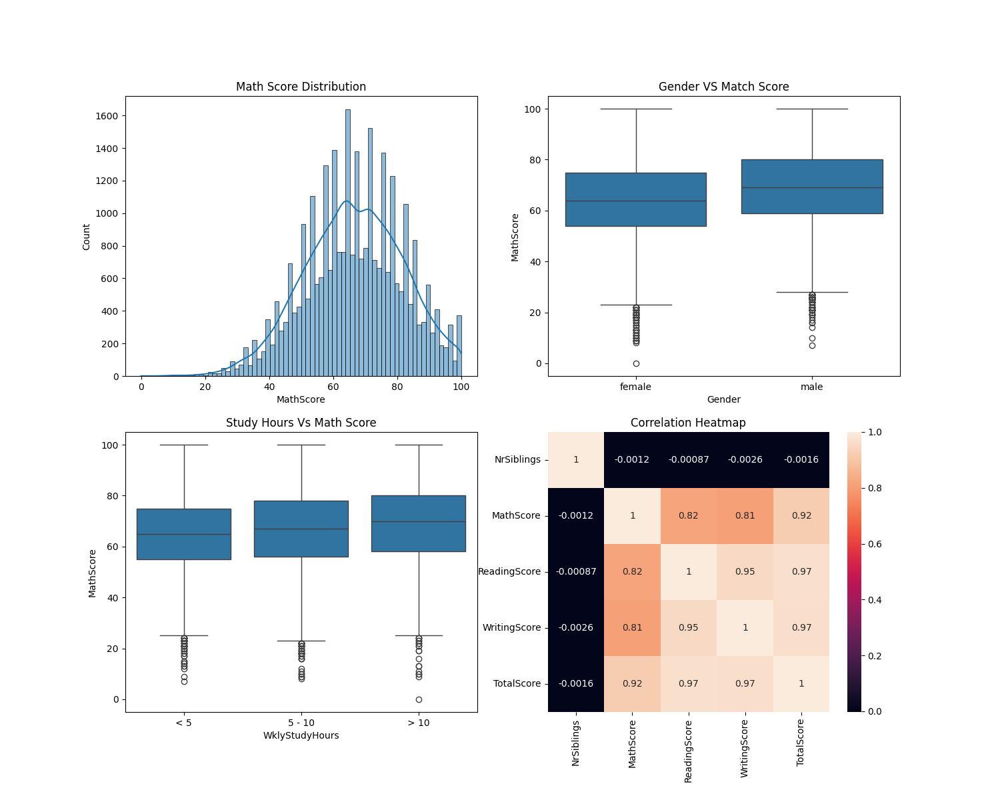
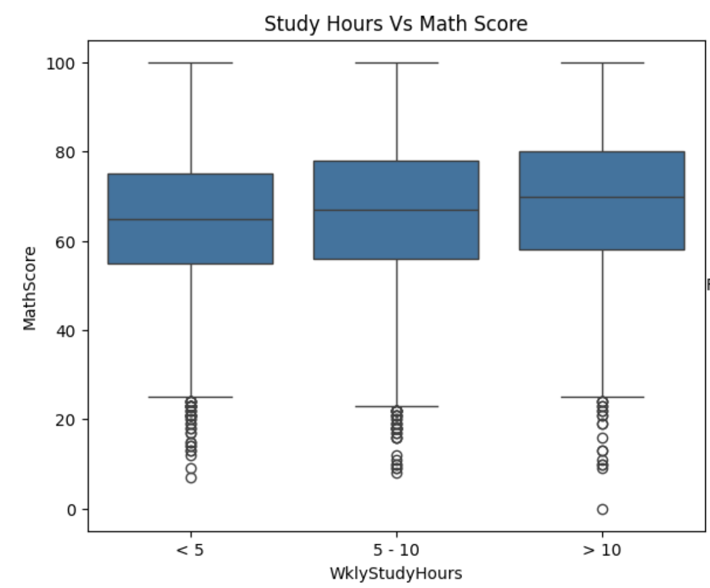

Student Performance Analysis (EDA)

This project performs Exploratory Data Analysis on student performance data to understand how different factors affect academic scores.

Project Objective -
The goal is to analyze the dataset and identify patterns influencing student performance in subjects like math, reading, and writing.

Dataset Features :-

- Gender  
- Ethnic Group  
- Parental Education  
- Lunch Type  
- Test Preparation  
- Weekly Study Hours  
- Math, Reading, Writing Scores  

Dashborads

Key Insights

1. Students who study more then 10 hours are score better  
2. Parent education has an impact on performance  
3. Strong correlation between math, reading, and writing scores  
4. Performance patterns vary across different student groups  

Tools Used

Python  
Pandas  
Matplotlib  
Seaborn  

Conclusion :-

EDA helps uncover meaningful insights from student data and prepares the dataset for machine learning models.
